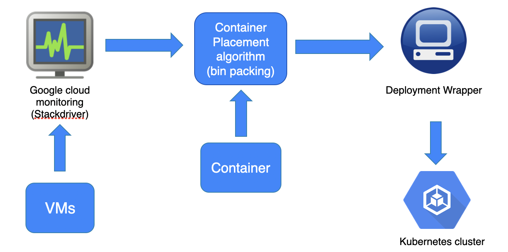
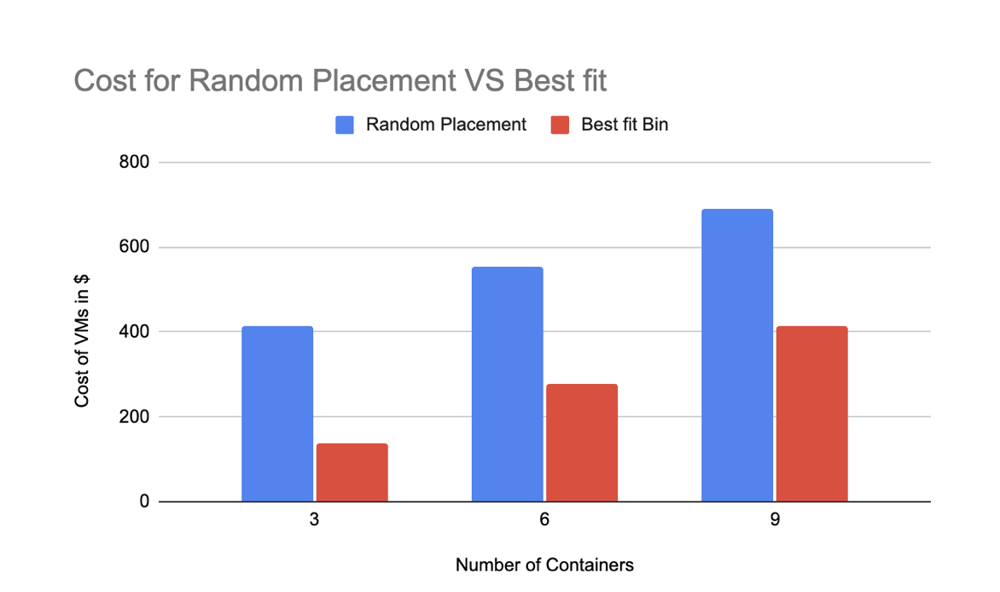

# Container Placement Optimization 

This repository contains the implementation of a container placement algorithm designed to optimize the allocation of containers on Kubernetes cluster hosted on Google Cloud virtual machine (VM) instances. By utilizing a best-fit bin packing approach, the algorithm significantly reduces VM resource utilization costs, resulting in a remarkable 67% cost reduction. The project also integrates the Stackdriver API to collect and analyze VM resource utilization data, which informs intelligent container placement decisions. Additionally, a custom wrapper named "customctl" has been developed around kubectl, using both Shell and Python scripts.

# Key Features

**Best-Fit Bin Packing Algorithm:** The core of this project lies in the implementation of a best-fit bin packing algorithm. This algorithm intelligently assigns containers to VM instances, optimizing resource utilization and significantly reducing VM resource utilization costs.

**Stackdriver API Integration:** The project leverages the Stackdriver API to gather and analyze VM resource utilization data. This data-driven approach aids in making informed container placement decisions, ensuring efficient utilization of resources.

**Customctl Wrapper:** The "customctl" wrapper simplifies the container deployment process on GCP VM instances. By combining Shell and Python scripts, it provides a streamlined interface to deploy containers using kubectl, contributing to improved overall project efficiency.

# Setting up the cloud environment
- Create VM instances on GCP with number of VM instances as needed.
- Install kubernetes on all the VM instances.
- Create kubernetes cluster with the instantiated VMs keeping one node as master node.
- Enable Stackdriver API to get VM utilization data.
-  Make sure you have Python and the necessary dependencies installed. You can set up a virtual environment to manage these dependencies effectively.

# Architecture

# Cost Minimization

# Getting Started
Once the cloud environment is set up, follow these steps:

Clone the Repository:  
Start by cloning this repository to your master node of kubernetes cluster using the following command:           

$`git clone https://github.com/mrunallachake/container-placement-optimization.git`

Change the project_id as per your GCP project in placement.py script.           
`project_id = "<your_project_name>"`

You can deploy the new containers using our placement algorithm by using below command:   

$`customctl apply <deployment_yaml_file>`

**Algorithm Implementation:** Explore the placement algorithm implementation from placement.py. Review the code and comments to understand how the best-fit bin packing approach is applied for container placement optimization.

**Examples and Demos:** The examples directory contains sample nginx container deployment yaml file and vm_utilization.json file which stores VM resource utilization sample data collected using Stackdriver API.

**Contributing:** Contributions to this project are welcome! If you'd like to contribute, please follow the standard GitHub workflow.

We appreciate your interest in this project!
